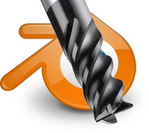

# BlenderCam - CNC path addon

Blender CAM is an open source solution for artistic CAM - Computer aided machining - a g-code generation tool.
Blender CAM is an extension for the free open-source Blender 3d package.

It has been used for many milling projects, and is actively developed.
If you are a developer who would like to help, fork and open pull requests

## Installation and Usage

See the [Wiki](https://github.com/vilemduha/blendercam/wiki).

## Resources

* [Development](https://github.com/blendercam/blendercam)
* [Documentation](https://github.com/vilemduha/blendercam/wiki)
* [Freenode IRC](http://webchat.freenode.net/?channels=%23blendercam) (#blendercam)
* [The Matrix](https://riot.im/app/#/room/#blendercam:matrix.org) (#blendercam:matrix.org)
* [Issue Tracker](https://github.com/blendercam/blendercam/issues)

## Dependencies

* Blender 2.80
* Python 2.7 & OpenCamLib (optional)

## DISCLAIMER

THE AUTHORS OF THIS SOFTWARE ACCEPT ABSOLUTELY NO LIABILITY FOR
ANY HARM OR LOSS RESULTING FROM ITS USE.  IT IS _EXTREMELY_ UNWISE
TO RELY ON SOFTWARE ALONE FOR SAFETY.  Any machinery capable of
harming persons must have provisions for completely removing power
from all motors, etc, before persons enter any danger area.  All
machinery must be designed to comply with local and national safety
codes, and the authors of this software can not, and do not, take
any responsibility for such compliance.

This software is released under the GPLv2.
