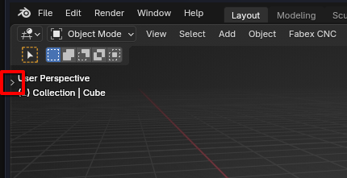
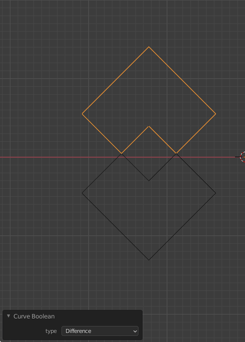
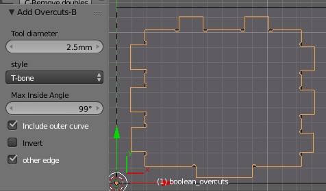
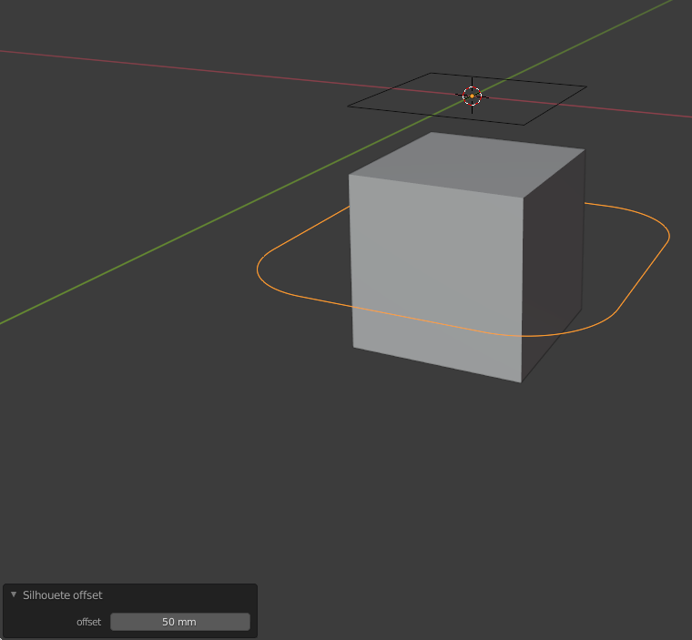
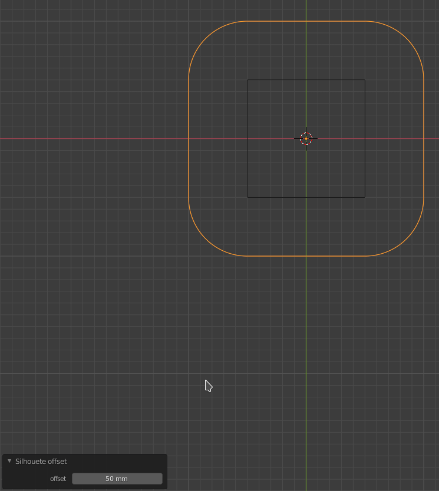
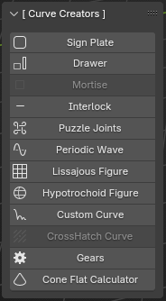
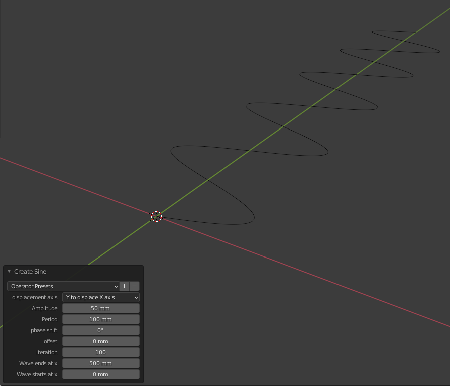

# Tools

**Fabex** has a number of tools that will modify selected curves to make them better suited to CAM operations. 

They can be found in the Tool Shelf Panel located on the left of the 3D view editor. 

The operators create new curves which can then be used in CAM operations.

## Open the Tool Shelf
If the Tool Shelf is not visible on the left of the 3D view then use the short cut **T** or use the mouse to left button select the small **>** near the top left border of the 3D view. 

 

```{note}
*The 3D view editor must be in Object Mode.*
```

## [ Curve Tools ]
Click the dropdown arrow to see the available Tools.


```{note}
*In older versions of **Blender**, select the **BlenderCAM** tab to view the **Curve CAM Tools** panel.*
```

## Curve Boolean
Perform a Boolean operation on two or more curves. A new curve will be created.

### Options:
- **Type** - choose from one of three Boolean operations:
  - **Union** - The result is a curve that forms a perimeter around the union (merger) of all curves selected:


  - **Difference** - subtract the first selected curve(s) from the last (active) selected curve:



  - **Intersect** - resulting curve is the curve portion common to all selected curves:


## Intarsion
Makes a new curve that is cuttable from both the inside and outside. 

This is useful for [intarsia](https://en.wikipedia.org/wiki/Intarsia), inlays, and joints.  


```{note}
*Works on mesh, text, and curve objects.*
```

### Options
- **Cutter Diameter** - Sharp edges will be rounded over using the Cutter diameter.

## Simple Fillet Overcuts
Adds overcuts for slots/inserts and creates a new curve. Works on text and curve objects.


The original curve is black, and the new curve with overcuts is in orange.

### Options:
  * **Diameter** - tool diameter to use for the overcut
  * **Threshold** - the minimum angle that an overcut is applied. 
  * **Outer Polygons** -
  * **Invert** - 

## Bone Fillet Overcuts
Add overcuts for slots/inserts/tabs and creates a new curve. Works on text and curve objects.  Three types of overcuts can be used: T-bone, Dog-bone, and opposite edge.


### Options:
- **Tool Diameter** - Diameter of the tool bit
- **Style**:
  - **T-Bone** - place overcuts so that a T shape is formed in a slot
  - **Dog-Bone/Corner Point** - place overcuts so that a dog bone shape is formed in a slot
  - **Opposite Edge** - when placing an overcut switch to the opposite edge from the last inside corner
- **Max Inside Angle** - if the angle of the corner is less than max inside angle then the corner is considered an inside corner and an overcut will be placed. 
- **Include Outer Curve** - If there are curves within curves then include the most outer curve
- **Invert** - make inside cut an outside cut or vice versa 
- **Other Edge** - move the overcut to the other edge

<!-- ### Examples:

- **T-Bone**


- **T-Bone Other Edge**


- **T-Bone Other Edge Invert**


- **T-Bone Other Edge**

 -->


## Silhouette 
This finds and creates the silhouette of objects(meshes, text, curves just get converted).


## Silhouette Offset




This operator create offsets on a silhouette in a new curve.

Operator Options:
  * **Offset** - tool diameter to use for the offset

## Remove Curve Doubles
This operator will convert the curve to a mesh, perform remove doubles on the mesh, and then convert it back to a curve.  

This can be used to fix curves that are imported into **Blender** from other applications i.e. .stl, .dxf, that may have overlapping control points in the curve which can be a problem when calculating an operation.

```{note}
Warning, removes bezier points! 
Does not create a new curve but modifies the original!
```

## Get Pocket Surfaces
This operator will detect pockets in a mesh and extract them as curves.  The curves can then be used for pocket operations.  Curves that are at the same z level will be in the same object.  All generated curve objects will be placed into the same group.


#### Options:
  * **horizontal threshold** - if 1.0 then perfectly flat surface, if < 1.0 then allow surfaces not perfectly flat.
  * **z limit** - flat surfaces that are below the z limit are considered a pocket.

The way the detection works is each face in the mesh is checked to see if it is horizontal and facing up by checking the face normal.  There is an operator option called **horizontal threshold** that is used to determine if the face is horizontal.  A value closer to 1.0 means that the face normal must be almost vertical ie the face must be almost perfectly flat. A value closer to 0.0 means that the face does not have to be perfectly horizontal ie part of a curved surface.

Operator option **z limit** controls which horizontal surfaces are considered a pocket.  If the horizontal surface z location is below the z limit then the surface is considered a pocket. Setting z limit to 0.0 (default setting) should work for most situations if mesh top is at z=0.0.

## [ Curve Creators ]
These operators will create shapes directly from the panel. 



**Periodic Wave**



**Lissajous figure**


**Hypotrochoid figure**


**Custom Curve**

