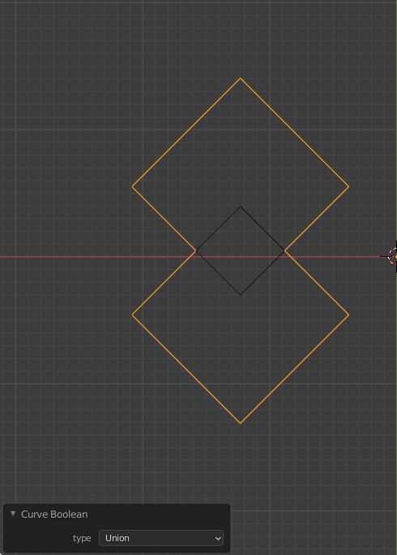

Blendercam has a number of curve operators that will modify selected curves to make them better suited to CAM operations. They can be found in the Tool Shelf Panel located on the left of the 3D view editor. The operators create new curves, in most cases, which can then be used in CAM operations.

* [View Tool Shelf](#view-tool-shelf)
* [View Blendercam Tools](#view-blendercam-tools)
* [Curve Boolean](#curve-boolean)
* [Intarsion](#intarsion)
* [Add Overcuts](#add-overcuts)
* [Add OvercutsB](#add-overcutsb)
* [Silhouette Offset](#silhouette-offset)
* [C-Remove Doubles](#c-remove-doubles)
* [Get pocket surfaces](#get-pocket-surfaces)

## View Tool Shelf
If the Tool Shelf is not visible on the left of the 3D view then use the short cut **T** or use the mouse to left button select the small **+** near the top left border of the 3D view.

 

## View Blendercam Tools

1. The 3D view editor must be in object mode. In older version of blender, select the **Blender CAM** tab to view the **Curve CAM Tools** panel.
2. Select the expansion arrow to see the tool buttons available.

## Curve Boolean

Perform a Boolean operation on two or more curves. A new curve is created.  The Boolean operations that can be performed are:
  * Union - The result is a curve that forms a perimeter around the union(merger) of all curves selected
  * Difference - subtract the first selected curve(s) from the last(active) selected curve.
  * Intersect - resulting curve is the curve portion common to all selected curves

## Intarsion

Makes a new curve that is cuttable from both the inside and outside.  This is useful for [intarsia](https://en.wikipedia.org/wiki/Intarsia), inlays, and joints.  All sharp edges are rounded over using the cutter diameter. Works on mesh, text, and curve objects.

## Add Overcuts

Adds overcuts for slots/inserts and creates a new curve.  Works on text and curve objects.

#### Operator Options:
  * **diameter** - tool diameter to use for the overcut
  * **threshold** - the minimum angle that an overcut is applied. 
  * **Outer polygons** -
  * **Invert** - 

## Add OvercutsB

An enhanced version of [Add Overcuts](#add-overcuts)

Add overcuts for slots/inserts/tabs and creates a new curve. Works on text and curve objects.  Three types of overcuts can be used: T-bone, Dog-bone, and opposite edge.

#### Operator Options:
* **Tool Diameter** - Diameter of the tool bit
* **Style**:
  * *T-Bone* - place overcuts so that a T shape is formed in a slot
  * *Dog-Bone/Corner Point* - place overcuts so that a dog bone shape is formed in a slot
  * *Opposite Edge* - when placing an overcut switch to the opposite edge from the last inside corner
* **Max inside angle** - if the angle of the corner is less than max inside angle then the corner is considered an inside corner and an overcut will be placed. 
* **Include outer curve** - If there are curves within curves then include the most outer curve
* **Invert** - make inside cut an outside cut or vice versa 
* **other edge** - move the overcut to the other edge

#### Examples:

##### T-Bone

##### T-Bone other edge

##### T-Bone other edge invert

##### T-Bone other edge

## Silhouette 
This operator finds and create the silhouette of objects(meshes, text, curves just get converted) 

## Silhouette Offset

This operator create offsets on a silhouette in a new curve.

Operator Options:
  * **offset** - tool diameter to use for the offset

## C-Remove Doubles
Curve remove doubles - warning, removes beziers! Does not create a new curve but modifies the original.

This operator will convert the curve to a mesh, perform remove doubles on the mesh, and then convert it back to a curve.  This can be used to fix curves that are imported into Blender from other applications i.e. stl, dxf, that may have overlapping control points in the curve which can be a problem when calculating an operation.

## Get pocket surfaces

This operator will detect pockets in a mesh and extract them as curves.  The curves can then be used for pocket operations.  Curves that are at the same z level will be in the same object.  All generated curve objects will be placed into the same group.

#### Operator Options:
  * **horizontal threshold** - if 1.0 then perfectly flat surface, if < 1.0 then allow surfaces not perfectly flat.
  * **z limit** - flat surfaces that are below the z limit are considered a pocket.

The way the detection works is each face in the mesh is checked to see if it is horizontal and facing up by checking the face normal.  There is an operator option called **horizontal threshold** that is used to determine if the face is horizontal.  A value closer to 1.0 means that the face normal must be almost vertical ie the face must be almost perfectly flat. A value closer to 0.0 means that the face does not have to be perfectly horizontal ie part of a curved surface.

Operator option **z limit** controls which horizontal surfaces are considered a pocket.  If the horizontal surface z location is below the z limit then the surface is considered a pocket. Setting z limit to 0.0 (default setting) should work for most situations if mesh top is at z=0.0.