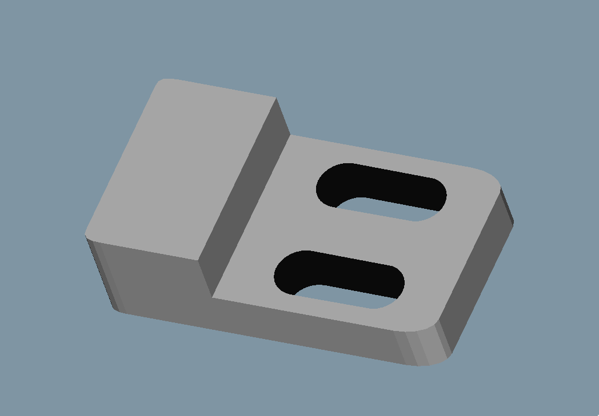
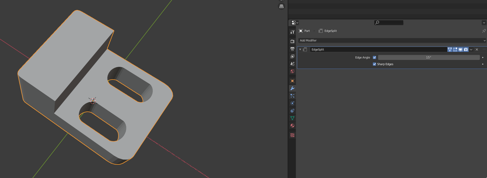
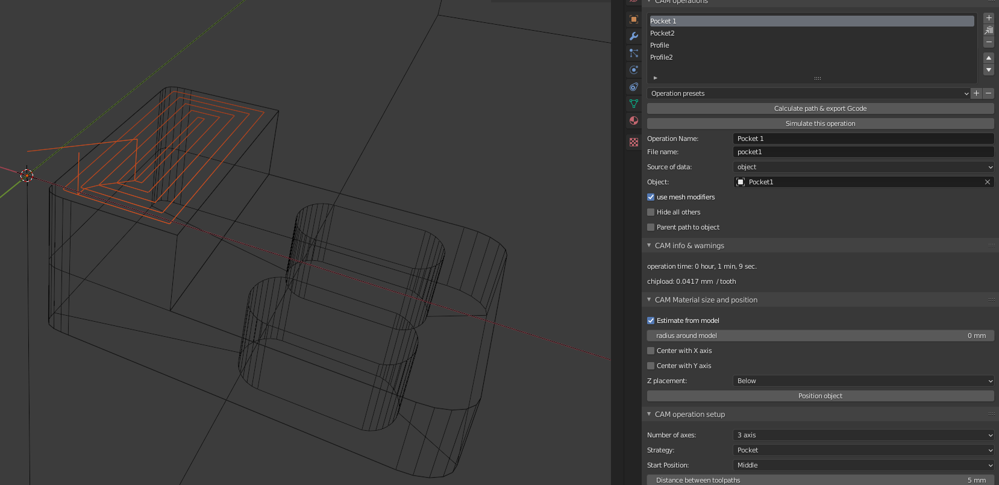
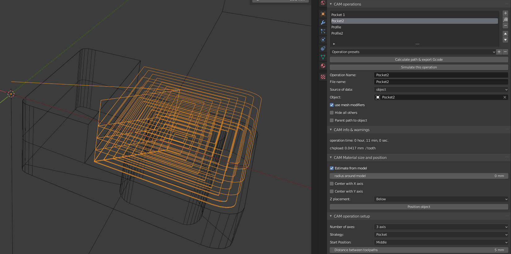

# Example Chain Workflow

1. Convert model from CSG to mesh (in this example FreeCAD is used for conversion). Precision setting is very important for correct result.

2. Save mesh as PLY or STL.

3. Import mesh to Blender.

4. use and apply 'Egde Split' modifier.

5. Enter Edit Mode and select surface (in Face Select mode) that will be a curve source, and 'Separate' it. Use Select Linked (L shortcut) to select whole faces.

6. Repeat with other curve sources.

7. Use 'Set Origin to Geometry' on all separated surfaces.

8. Exit Edit Mode and select separated surfaces. Convert them to curves using 'Convert to' (Alt C).

or you can use "Object silhouette" from blendercam tool :

9. Edit curves to separate holes from external contour.

10. Add Pocket and Profile operations : 

for pads/pockets (some curves need to be modified in 'Edit Mode'):

It's highly recommended to create roughing and finishing pass. For roughing pass add offset by altering cutter's diameter. For Profile operation, 'First Down' and 'Ramp In' options are recommended. 'First Down' helps avoid non-cutting moves and 'Ramp In' reduces cutter load by avoiding vertical plunge into material. For Pocket operation instead of 'Ramp In' try using 'Helix enter' option.

