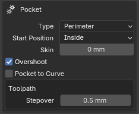
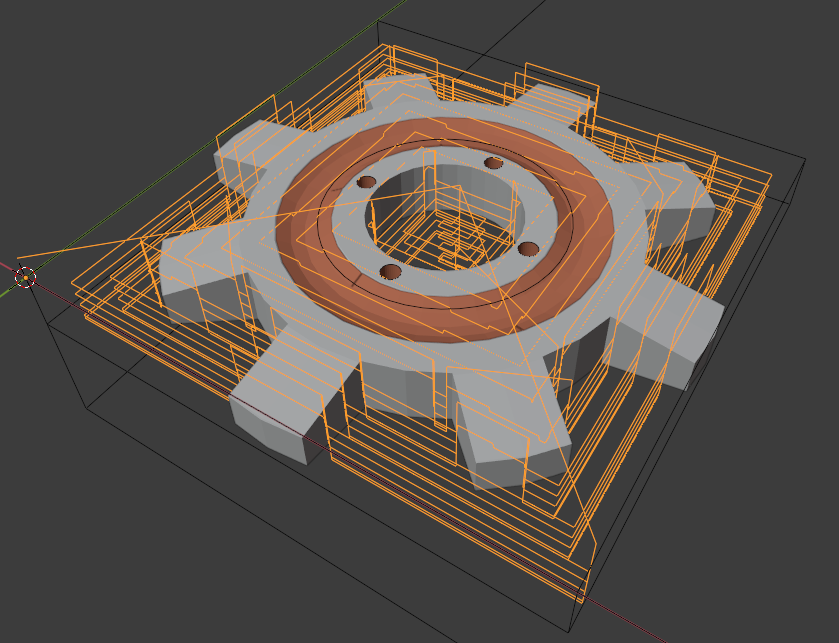

# Strategies

## Profile (Cutout)
Cutout a silhouette using an optional offset.

### Options

- **Cut** - which side of the path to place the Cutter - *Inside, Outside, On Line*
- **Start Point** - which path point to start with
- **Skin** - excess material to leave during Roughing
- **Overshoot**
- **Radius**
  - **Lead-in**
  - **Lead-out**
- **Outlines**
  - **Count**
- **Don't Merge**
---

## Pocket
Mills a pocket in the shape of the selected object.

  

### Options

- **Type**
- **Start Position**
- **Skin**
- **Overshoot**
- **Pocket to Curve**
- **Toolpath**
  - **Stepover**
---

## Drill
Detects circles or squares in any 2D curve and converts these into a drill operation.  Supports peck drilling if layers are enabled.

  

### Options

- **Holes On**
---

## **Parallel**
Parallel paths at any angle.

### Options

- **Inverse Milling**
- **Skin**
- **Angle of Paths**
- **Toolpath**
  - **Stepover**
  - **Detail**
---

## Cross
Perpendicular paths at any angle.

  

### Options

- **Inverse Milling**
- **Skin**
- **Angle of Paths**
- **Toolpath**
  - **Stepover**
  - **Detail**
---

## Block

  

### Options

- **Inverse Milling**
- **Toolpath**
  - **Stepover**
  - **Detail**
---

## Spiral
Best suited for coins or other circular objects

  

### Options

- **Inverse Milling**
- **Toolpath**
  - **Stepover**
  - **Detail**
---

## Circles
Best suited for coins or other circular objects

  

### Options

- **Inverse Milling**
- **Toolpath**
  - **Stepover**
  - **Detail**
---

## Outline Fill

  

### Options

- **Inverse Milling**
- **Toolpath**
  - **Stepover**
  - **Detail**
---

## Carve
Projects any 2d curve on 3d surface

 

### Options

- **Depth**
- **Skin**
- **Toolpath**
  - **Detail**
---

## Waterline

### Options

- **Slice Detail**
- **Skin**
- **Project Paths**
- **Fill Between Slices**
- **Toolpath**
  - **Stepover**
---

## Curve to Path

### Options

- **Outlines**
  - **Count**
- **Don't Merge**
---

## Medial Axis

### Options

- **Threshold**
- **Detail Size**
- **Add Pocket**
- **Add Medial Mesh**
---

## **Overview of Principle Strategies**

